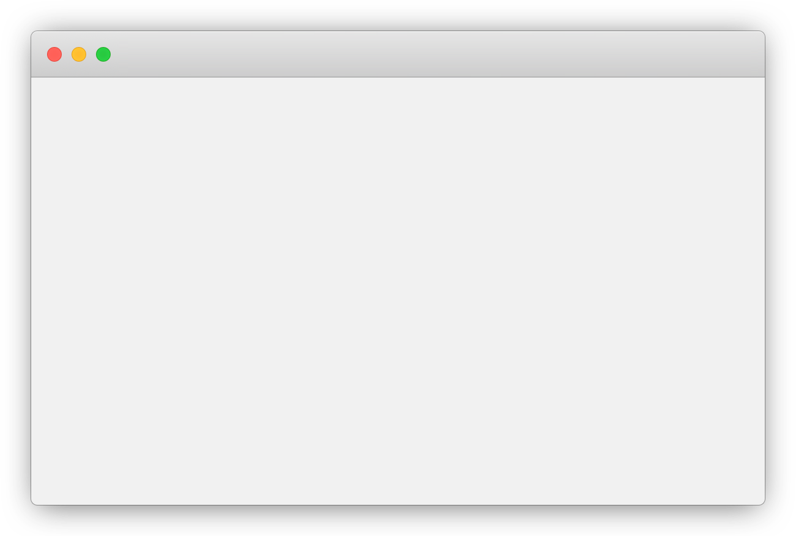

[](https://classroom.github.com/a/M6x3p3QZ)
[](https://classroom.github.com/open-in-codespaces?assignment_repo_id=15107203)
# Título del proyecto de aplicación web

[comment]: # (Incluir una breve descripción del proyecto en una o dos frases como mucho)

Aplicación web basada en Express.js que...

[comment]: # (Incluir un GIF o una captura de pantalla de la página principal del proyecto. Utilizar el directorio docs para almacenar dicha imagen)



## Tabla de contenidos

* [Introducción](#introducción)
  * [Características](#características)
  * [Tecnologías](#tecnologías)
* [Uso de la aplicación](#uso-de-la-aplicación)
  * [Estructura del proyecto](#estructura-del-proyecto)
  * [Instalación](#instalación)
  * [Configuración](#configuración)
  * [Ejecución](#ejecución)
  * [Desarrollo](#desarrollo)
* [Pruebas](#pruebas)
* [Despliegue](#despliegue)
* [Créditos](#créditos)

## Introducción

### Características

[comment]: # (Enumerar las principales características que ofrece la aplicación web, siguiendo el formato:)

* Característica principal 1.
* Característica principal 2.
* ...


### Tecnologías

Este proyecto ha sido desarrollado utilizando:

* [Express](https://expressjs.com/) - Framework web
* [Mongoose](https://mongoosejs.com/) - ODM para trabajar con una base de datos MongoDB
* [Localtunnel](https://localtunnel.me) - Tunel HTTPS para la aplicación web
* [Jest.js](https://jestjs.io/) - Framework de pruebas
* [Pico.css](https://picocss.com/) - Framework CSS


## Uso de la aplicación

### Estructura del proyecto

```
.
├── .devcontainer/                  # Configuración de Codespaces y Dev Containers
├── .idx/                           # Configuración para Project IDX
├── .vscode/                        # Configuración de Visual Studio Code
├── public/                         # Frontend de le aplicación
│   ├── css/                        # Directorio de estilos CSS (generado durante la compilación)
│   ├── img/                        # Directorio para almacenar imágenes
│   │   └── *
│   ├── js/                         # Directorio para almacenar scripts
│   │   └── *
│   ├── scss/                       # Directorio para almacenar los estilos Sass
│   │   └── *.scss                  
│   └── *.html
├── src/                            
│   ├── controllers/                # Controladores
│   │   └── *.js                    
│   ├── middlewares/                # Middleware de la aplicación
│   │   └── *.js                    
│   ├── models/                     # Modelos de datos
│   │   └── *.js                    
│   ├── routes/                     # Rutas de la aplicación
│   │   └── *.js                    
│   ├── views/                      # Vistas de la aplicación
│   │   └── *.js                    
│   └── app.js                      # Punto de entrada de la aplicación web
├── tests/                          # Pruebas unitarias (con estructura similar a src/)
│   └── *.test.js                   
├── .gitignore                      # Archivos que no se van a subir al repositorio
├── build.js                        # Script a cargo de la 'compilación'
├── docker-compose.yml              # Archivo de despliegue en docker
├── Dockerfile                      # Archivo de construcción de imagen en docker
├── package-lock.json               # Configuración de npm y node 
└── package.json                    # Configuración de npm y node 
```


### Instalación

Clonar este repositorio y ejecutar desde el directorio raíz el siguiente comando para instalar las dependencias:

```bash
$ npm install
```

Antes de desplegar la aplicación, es necesario generar el frontend.  
Este proceso se realiza de manera automática cada vez que se arranca la aplicación.  
No obstante, se puede generar el frontend manualmente con el siguiente comando:

```bash
$ npm run build
```

### Configuración

Para configurar la aplicación web, existen dos versiones: la version de producción y la version de desarrollo.  
Ambas versiones de la configuración se realizan a traves del fichero `.env` que se encuentra en el directorio raíz.  
Para la version de desarrollo basta con configurar las siguientes variables:

```bash
# La url de mongodb (instalado en local o haciendo uso de Mongo Atlas)
MONGO_URI = "mongodb://localhost:27017/db"

# El puerto en el que la aplicación estará escuchando
PORT = 3000

# El secreto para el jwt
JWT_TOKEN_SECRET = ""
```
> Para generar el secreto del jwt, almacenar en `JWT_TOKEN_SECRET` el secreto generado por el siguiente comando:

```bash
$ node -e "console.log(require('crypto').randomBytes(32).toString('hex'))"
```

Para la version de producción, se proporciona un archivo `.env.example` de ejemplo, con todas las variables necesarias para su correcto funcionamiento.  


### Ejecución

Para ejecutar la aplicación web, ejecutar el siguiente comando desde el directorio raíz:

```bash
$ npm start
```

### Desarrollo

Existen otras dos tareas adicionales para facilitar las labores de desarrollo. Estas son las siguientes:
```bash
# Para revertir el proceso de compilación de la aplicación
$ npm run clean

# Para ejecutar la aplicación, pudiendo ver los cambios en tiempo real
$ npm run dev
```

## Pruebas

La aplicación contiene un banco de pruebas que permite comprobar el correcto funcionamiento de la aplicación.  
Para ejecutarlo se debe ejecutar el siguiente comando desde el directorio raíz:

```bash
$ npm test
```

## Despliegue

La aplicación contiene los archivos necesarios para desplegar la aplicación en docker.  
La configuración de despliegue contienen una base de datos mongodb integrada y una interfaz web que permite interactuar con la base de datos.  
Para realizar el despliegue, basta con utilizar el siguiente comando:

```bash
$ docker-compose up -d
```

Para detener el despliegue, se debe ejecutar el siguiente comando:

```bash
$ docker-compose down
```

> Dependiendo de la instalación de Docker, el comando `docker-compose` puede ser sustituido por `docker compose`.

## Créditos

Este proyecto ha sido desarrollado por el grupo *1c-g07*, formado por:

* Miguel Sahelices Sarmiento
* Carlos Prieto Viñuela
* Esteban Salazar Peña
* Alejandro Alonso Pérez
* Daniel Alejandro Greciano Antón
